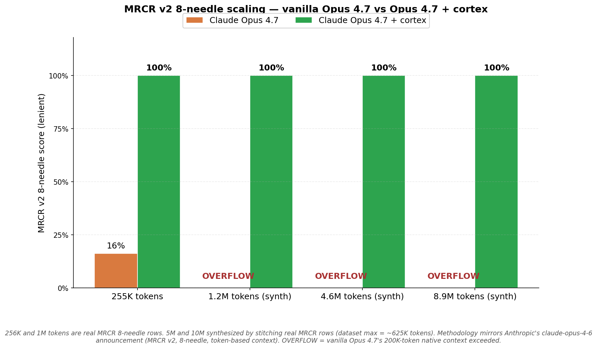
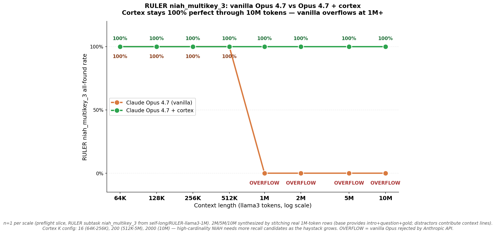
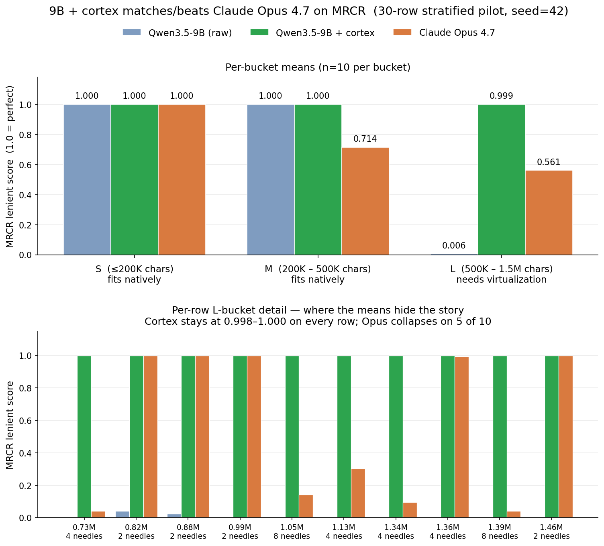

# cortex

**A proxy layer for long-context retrieval on top of any LLM.** Cortex
embeds and cosine-ranks cold chat-history message-groups against a
reformulated query and injects the top-K **verbatim** into the system
prompt. Inference-time only — no model modification, no fine-tuning,
no KV-cache surgery. Drop-in proxy for the Anthropic Messages API and
the OpenAI Chat Completions API.

**Calibration**: Anthropic
[reports](https://www.anthropic.com/news/claude-opus-4-6) Opus 4.6
(1M-token native context) scoring **76%** on the MRCR v2 8-needle 1M
variant; Sonnet 4.5 scores **18.5%**. **Opus 4.7 + cortex scores 100%
at 1M tokens** on the same benchmark and **stays at 100% through 10M
tokens**. Same result on RULER `niah_multikey_3` from 64K to 10M llama3
tokens. A local Qwen3.5-9B routed through cortex hits 100% on 30
stratified MRCR rows (raw 9B: 67%, raw Opus 4.7: 73%).

---

### Demo 1 — MRCR v2 8-needle at Anthropic's published scales



Same four context lengths Anthropic measures in the
[claude-opus-4-6 announcement](https://www.anthropic.com/news/claude-opus-4-6).
Vanilla Opus 4.7 (200K native context) scores **16%** at 256K and the
Anthropic API rejects every request at 1M+. **Opus 4.7 + cortex scores
100% at every scale**, including past Opus 4.6's 1M-token native limit,
by compressing up to ~39K cold messages into 7 verbatim turns + a
~6K-token recap.

| context | vanilla Opus 4.7 | Opus 4.7 + cortex | reference (Anthropic) |
|--------:|-----------------:|------------------:|----------------------:|
| 256K    | 16%              | **100%**          | —                     |
| 1M      | OVERFLOW         | **100%**          | Opus 4.6: **76%**     |
| 5M      | OVERFLOW         | **100%**          | beyond Opus 4.6 limit |
| 10M     | OVERFLOW         | **100%**          | beyond Opus 4.6 limit |

n=4, seed=42, lenient rubric (`response.lstrip()` then strict
random-string prefix check + `SequenceMatcher` ratio). 256K and 1M are
real MRCR 8-needle rows from `openai/mrcr` (dataset max ≈ 625K tokens
per row); 5M and 10M are *synthesized* by stitching real rows with the
gold needle preserved in the base row. Token counts via char/4
convention. Reproduce:

```bash
# After Path A install (below), with cortex.server running on :8080:
PYTHONPATH=. .venv/Scripts/python.exe bench/pilot_opus/run.py \
  --targets 256000,1000000,5000000,10000000 --unit tokens \
  --n-needles 8 --seed 42 \
  --out results/opus_vs_cortex/mrcr_v3.json
```

Raw output: [results/opus_vs_cortex/mrcr_v3.json](results/opus_vs_cortex/mrcr_v3.json).
Chart code: [bench/pilot_opus/make_chart_v3.py](bench/pilot_opus/make_chart_v3.py).

---

### Same result, second benchmark: RULER niah_multikey_3 to 10M tokens



To rule out MRCR-specific quirks, we re-ran the experiment on
[RULER](https://huggingface.co/datasets/self-long/RULER-llama3-1M) — a
different long-context benchmark, different rubric, different needle
shape. **Cortex stays 100% perfect at every scale from 64K to 10M
llama3 tokens.** Vanilla Opus 4.7 matches cortex through 512K, then
the Anthropic API rejects every request at 1M+ outright.

Two independent benchmarks, two orders of magnitude past Anthropic's
published context window, same result.

n=1 per scale (preflight slice of the RULER `niah_multikey_3` subtask).
The 64K-1M rows are real RULER-llama3-1M samples; 2M/5M/10M are
synthesized by stitching the 1M base row with additional RULER
distractor lines. **Cortex's `verbatim_recall_k` is tuned per scale**
(K=16 default, K=200 at 512K-5M, K=2000 at 10M) — high-cardinality NIAH
needs more recall candidates as the haystack grows. K is a config knob,
not a fundamental limit; the recap budget bounds insertion regardless
of K (still ~65K tokens at 10M). Methodology and raw data:
[bench/pilot_opus/run_ruler.py](bench/pilot_opus/run_ruler.py),
[results/opus_vs_cortex/ruler_all.json](results/opus_vs_cortex/ruler_all.json).

---

### A local 9B + cortex matches Opus on MRCR



Same proxy, different model. **Qwen3.5-9B + cortex hits 100% perfect
on 30 MRCR rows. Vanilla Opus 4.7 hits 73%.** The 9B catches the
frontier on retrieval-shaped tasks because cortex pre-locates the
needles — the model only has to read the recap.

n=30 single-seed pilot. Strict-rubric is 0 across both 9B arms (qwen3.5
prepends `\n\n`); the lenient rubric is the headline. Full caveats:
[bench/pilot_cortex/PAPER.md](bench/pilot_cortex/PAPER.md).

## What it is

Cortex is an HTTP proxy in front of any OpenAI- or Anthropic-compatible
LLM endpoint. When a conversation exceeds the upstream model's window,
cortex:

1. **Reformulates the query** with one small LM Studio call — strips
   meta-instructions to extract the topical retrieval phrase.
2. **Embeds and cosine-ranks every cold message-group** inline against
   the reformulated query (no Qdrant roundtrip — works on a first turn).
3. **Injects the top-K verbatim** into a `<retrieved_history>` block in
   the system prompt, chronologically ordered.

The model sees its original system prompt + the relevant verbatim turns
+ the last few message-groups + the query, picks the right content from
the recap, and responds.

When the conversation fits natively, cortex **short-circuits to
pass-through** — the model sees byte-identical input to raw. (Verified:
S/M-bucket cortex == raw on the pilot.)

## How this relates to prior work

The long-context problem has three orthogonal solution families. Cortex
sits squarely in the third — and the SOTA literature suggests this is
the family that scales most cleanly past native window limits on
retrieval-shaped tasks.

**1. Native long-context architectures.** Training models to attend over
longer sequences directly. Recent examples include Anthropic's
[Opus 4.6](https://www.anthropic.com/news/claude-opus-4-6) (1M tokens
native), Gemini 1.5 Pro, Jamba-1.5-large, and Qwen2.5-14B-1M. RULER
([Hsieh et al., 2024](https://arxiv.org/abs/2404.06654)) shows even the
best of these degrade past their effective context — and the [LongMemEval
ICLR 2025 paper](https://arxiv.org/abs/2410.10813) finds 30–60%
performance drops on advanced long-context LLMs (GPT-4o, Llama 3.1,
Phi-3) vs. oracle retrieval at ≥115K-token chat histories. Cortex
inverts this: rather than ask the model to attend over the whole
history, give it a small recap that fits in its high-attention zone.

**2. KV-cache compression.** Operates inside the model: keep heavy-hitter
tokens, evict the rest. StreamingLLM
([Xiao et al., 2023](https://arxiv.org/abs/2309.17453)), H2O
([Zhang et al., 2023](https://arxiv.org/abs/2306.14048)), SnapKV
([Li et al., 2024](https://arxiv.org/abs/2404.14469)), and more recent
work like [RocketKV](https://arxiv.org/abs/2502.14051) reduce GPU memory
during inference but require model access and don't help if the input
itself exceeds the context window. Cortex is API-side: works on any
model you can call over HTTP, including closed frontier APIs.

**3. Retrieval / memory systems.** Standard RAG, plus more elaborate
memory architectures: MemGPT ([Packer et al., 2024](https://arxiv.org/abs/2310.08560))
(OS-style paging), Mem0, LongMem, A-MEM, MemMachine. Most do fact
extraction or summarization — useful for cross-session memory but lossy
for needle-in-haystack tasks where the answer is a verbatim string.
Cortex is the **verbatim** variant: cold message-groups are inserted
without summarization, preserving exact text for retrieval. Recent RAG
↔ long-context work
([Yu et al., 2024](https://arxiv.org/abs/2410.05983);
[Li et al., 2025](https://arxiv.org/abs/2501.01880);
[Yang et al., 2025](https://arxiv.org/abs/2502.12462)) finds the two
approaches are complementary rather than substitutable. Anthropic's own
memory product
([Sep 2025](https://platform.claude.com/docs/en/agents-and-tools/tool-use/memory-tool))
is a file-based markdown store with just-in-time retrieval — closer to
cortex in shape than to vector-DB RAG, but storage rather than inference-
time injection.

**What's specific to cortex:**
- **Verbatim insertion** of cold message-groups, not summary. Critical
  for needle tasks where summarization destroys the signal.
- **One small LLM call** for query reformulation (the only extra LLM
  call beyond the upstream); then cosine ranking on embeddings.
- **Proxy architecture** — works on closed-frontier APIs (Anthropic,
  OpenAI) and local OpenAI-compat servers (LM Studio, vLLM, llama.cpp)
  with no model access required.
- **Bounded recap budget** (~5-65K tokens) regardless of haystack size,
  so the model always sees input inside its high-attention zone.

## Install

Two supported paths. They share the same backends (Neo4j + Qdrant + an
in-process fastembed embedder) and the same proxy binary. They differ in
**what runs the LLM calls**: the Claude Code path uses your existing
`claude` subscription via the local CLI; the local-model path uses LM
Studio + Qwen3.5-9B.

Path A prerequisites: Docker, Python 3.11+, the `claude` CLI on PATH.
Path B prerequisites additionally need LM Studio for the upstream model.

---

### Path A -- Claude Code plugin (one-command install, recommended)

`pipx install` plus `timegraph init` plus a Claude Code `marketplace add`.
Memory works in any project automatically from that point on, with no
scripts to copy and no `.claude/settings.json` edits.

```bash
# 1. Install the engine + CLIs (timegraph, timegraph-mcp,
#    timegraph-hook-{ingest,recall,tool-use,session-start}, cortex-serve).
pipx install git+https://github.com/jamoeight/cortex-mcp.git
# (PyPI: `pipx install timegraph-mcp` once published)

# 2. Bring up Neo4j + Qdrant, apply schema, init Qdrant collections,
#    prefetch the fastembed model (~270 MB nomic-embed-text-v1.5).
timegraph init
```

Then in Claude Code, once per machine:

```
/plugin marketplace add jamoeight/cortex-mcp
/plugin install timegraph-cortex
```

Then point Claude Code at the local cortex proxy. The plugin's `SessionStart`
hook starts the proxy on `127.0.0.1:8080`, but Claude Code plugins cannot
inject environment variables into the already-running host process — so this
variable has to be set in the shell **before** `claude` launches. Without it,
Claude Code goes direct to `api.anthropic.com`, the plugin's hooks still work
(recall + ingest), but no virtualization happens.

**macOS / Linux (bash, zsh):**

```bash
export ANTHROPIC_BASE_URL=http://127.0.0.1:8080
# Persist across shells — append to whichever rc file you use:
echo 'export ANTHROPIC_BASE_URL=http://127.0.0.1:8080' >> ~/.zshrc   # or ~/.bashrc
```

**Windows (PowerShell — recommended):**

```powershell
$env:ANTHROPIC_BASE_URL = "http://127.0.0.1:8080"
# Persist across PowerShell sessions (user scope, no admin needed):
[Environment]::SetEnvironmentVariable("ANTHROPIC_BASE_URL", "http://127.0.0.1:8080", "User")
```

**Windows (cmd.exe):**

```cmd
set ANTHROPIC_BASE_URL=http://127.0.0.1:8080
:: Persist across sessions:
setx ANTHROPIC_BASE_URL http://127.0.0.1:8080
```

Then restart Claude Code in the same shell you set the variable in (or any new
shell if you used the persist line). Verify with `echo $ANTHROPIC_BASE_URL`
(macOS/Linux) or `echo $env:ANTHROPIC_BASE_URL` (PowerShell) before launching
`claude`.

**Upgrading from a prior install:** re-run both — pipx to land any new
entry-point wrappers on PATH (e.g. when 0.1.0 → 0.2.0 added
`timegraph-hook-{tool-use,session-start}`), and Claude Code's plugin
update to pick up the new manifest:

```bash
pipx install --force git+https://github.com/jamoeight/cortex-mcp.git
```

```
/plugin update timegraph-cortex
```

Restart Claude Code so `SessionStart` fires with the new manifest. Memory is live. The plugin gives Claude Code an
**effectively infinite context window** by wiring four hooks + an MCP
server + three slash commands, so the user never recalls by hand:

1. **MCP server** — exposes the 5 timegraph tools (`remember`, `add_fact`,
   `recall`, `query`, `attest`) for when Claude wants explicit access.
2. **`UserPromptSubmit` hook** — embeds every prompt, runs *two* parallel
   semantic searches (the fact graph + the episode store), merges the
   results into `additionalContext`. Claude sees both extracted facts AND
   raw prior content (file bodies, bash outputs) unprompted.
3. **`Stop` hook** — high-water-mark transcript scanner. Tracks a byte
   offset per session at `~/.timegraph/sessions/<session_id>.json` and
   ingests every *new* user prompt and assistant response since the last
   fire. Offset advances incrementally per episode, so a partial timeout
   leaves the system in a correct state.
4. **`PostToolUse` hook** — after every `Read`/`Edit`/`Write`/`Bash`/
   `Grep`/`Glob`/`WebFetch`/`WebSearch`, ingests the result as an episode
   keyed by `source=file:<path>` (or `bash:<hash>`, `search:Grep`, etc.).
   Extraction is skipped here — embeddings carry the recall, and the
   fact graph stays focused on user/assistant *statements*. This is
   what makes a file you read in turn 3 still recallable in turn 200,
   even after Claude Code auto-compacts.
5. **`SessionStart` hook** — idempotently starts `cortex-serve` on
   `127.0.0.1:8080` if `/health` is not already responding, logs to
   `~/.timegraph/cortex.log`, and primes new and resumed sessions with the
   top facts for this `cwd`; on `source=compact`, re-injects what was
   just summarized away, making compaction lossless from the user's view.

Slash commands (`/timegraph-cortex:status`, `…:recall <query>`,
`…:forget <pattern>`) cover stats, manual deep recall, and privacy.

Each project gets its own `group_id` derived from `cwd`, so memories
stay isolated across repos with no per-project config. Run
`timegraph status` for backend health, `timegraph stats` for per-project
episode/fact counts.

**Opus generation never goes through `claude -p`.** Claude Code keeps
using its native OAuth path -- the June 2026 `-p` pricing change doesn't
apply to your normal Claude Code usage. The only `-p` calls are the
bounded Haiku 4.5 judge inside timegraph ops (fact extraction during
ingest, conflict resolution during `query`). Measured in cents per
session.

#### Manual setup (contributors developing the plugin itself)

If you're working on this repo rather than installing the plugin, the
dev wiring still works. The repo's `.claude/settings.json` already points
at `scripts/hook_{ingest,recall}.py`, which are thin shims that delegate
to the packaged modules. Bring up backends with the repo-root compose
file and you're done:

```bash
docker compose up -d                              # Neo4j + Qdrant
python -m venv .venv && .venv/Scripts/pip install -e .
.venv/Scripts/python.exe -m timegraph.storage.schema --apply
.venv/Scripts/python.exe -c "import asyncio; from timegraph.storage.qdrant_client import ensure_collections; asyncio.run(ensure_collections())"
claude                                            # approve project hooks when prompted
```

`.mcp.json` at the repo root registers the MCP server with the same
`claude_cli` judge env the plugin uses, so behavior matches.

#### Latency notes

- **Recall hook** (`UserPromptSubmit`): ~2–5 s before each user turn
  (one embed call + two parallel Qdrant lookups — facts + episodes).
  Visible as a brief pause.
- **Tool-use hook** (`PostToolUse`): runs after every tool call. One
  embed + one Qdrant upsert + one Neo4j write (~0.3–1 s). No
  extractor call — embed-only ingest is what keeps it cheap.
- **Ingest hook** (`Stop`): runs after the assistant response is
  already on screen — doesn't block UX. Fires one `-p --model haiku`
  call per new message to extract facts (~10–30 s on Windows Claude
  CLI subprocess, faster on macOS/Linux). The 60 s hook timeout caps
  how many messages get ingested per fire; the high-water-mark cursor
  resumes on next fire so nothing is lost.
- **Session-start hook**: ~1–2 s on startup/resume; ~2–3 s on
  `source=compact` (slightly larger recall budget for the
  anti-compaction recap).
- **No `-p` for Opus.** Worth saying twice: only the cheap judge uses
  `-p`. Your subscription Opus usage is unchanged.

#### Wiring a non-Claude-Code client

For opencode, continue.dev, an SDK, etc., start the cortex HTTP proxy
on `:8080` and point the client there:

```bash
TG_JUDGE_BACKEND=claude_cli \
TG_JUDGE_CLAUDE_MODEL=haiku \
CORTEX_DEFAULT_PROVIDER=anthropic \
CORTEX_USE_CLAUDE_CLI_PROVIDER=true \
CORTEX_ENABLE_AUTO_INGEST=false \
CORTEX_ENABLE_VIRTUALIZATION=true \
CORTEX_ENABLE_VERBATIM_RECALL=true \
CORTEX_ENABLE_QUERY_REFORMULATION=true \
CORTEX_LAST_K_SPANS=2 \
CORTEX_VERBATIM_RECALL_K=24 \
  .venv/Scripts/python.exe -m cortex.server &
```

This path **does** use `-p` for upstream generation — necessary because
non-Claude-Code clients can't piggyback Claude Code's native OAuth — so
the June pricing change does apply here. Use this path if your client
isn't Claude Code; use the hook setup above if it is.

---

### Path B — Local model only (LM Studio + Qwen3.5-9B, fully offline)

Runs everything on your own hardware. Upstream model, judge, embedder are
all local. This is the configuration the headline 9B-matches-Opus pilot
in `results/pilot_cortex/` was run on.

```bash
# 1. Load the 9B alongside the embedder.
lms load qwen/qwen3.5-9b --identifier qwen/qwen3.5-9b --context-length 100000 --gpu max --ttl 86400
lms ps                                        # verify CONTEXT=100000

# 2. Start the cortex proxy on :8080.
CORTEX_DEFAULT_PROVIDER=openai \
CORTEX_OPENAI_BASE_URL=http://127.0.0.1:1234 \
CORTEX_ENABLE_AUTO_INGEST=false \
CORTEX_ENABLE_VIRTUALIZATION=true \
CORTEX_ENABLE_VERBATIM_RECALL=true \
CORTEX_ENABLE_QUERY_REFORMULATION=true \
CORTEX_UPSTREAM_CONTEXT_LIMIT=100000 \
CORTEX_LAST_K_SPANS=2 \
CORTEX_VERBATIM_RECALL_K=24 \
  .venv/Scripts/python.exe -m cortex.server &

# 3. Reproduce the 9B-matches-Opus benchmark.
PYTHONPATH=src .venv/Scripts/python.exe bench/pilot_cortex/run.py \
  --seed 42 --per-bucket 10 --out results/pilot_cortex/scale30.json
```

Hardware target: ~24 GB VRAM for Qwen3.5-9B at 100K context + nomic
embedder. Tested on RTX 4090.

---

Cortex exposes OpenAI-compatible `/v1/chat/completions` and
Anthropic-compatible `/v1/messages` on both paths. Point any client at
`http://127.0.0.1:8080`.

## What this does NOT claim

- **Cortex does not make a 9B reason like Opus.** It gives the model the
  right context, not better reasoning. For multi-hop logic, refactors,
  or system design — use a frontier model. Cortex buys you frontier
  *memory* at the upstream model's inference cost.
- **Strict-rubric scores are 0** across every 9B arm (raw and cortex
  both) — qwen3.5-9b's chat template prepends `\n\n`. The lenient rubric
  (lstrip → same prefix check) is the headline; PAPER.md has the full
  caveat.

## How fast

| bucket | path                  | p50 latency |
|--------|-----------------------|------------:|
| S      | pass-through (≤200K)  | 51 s        |
| M      | pass-through (≤500K)  | 49 s        |
| **L**  | **virtualized (1M+)** | **23 s**    |

On the L bucket cortex is at frontier-latency parity (Opus p50 = 21 s)
because the model sees ~16K tokens (recap + verbatim window) instead of
1M characters. Pass-through is bottlenecked by the 9B model itself.

## What else is in this repo

This repo also contains the original **timegraph** capability layer —
the temporal property graph + bounded-1-LLM-call retrieval engine that
cortex's graph-recall fallback uses. Standalone results (full README
preserved in [docs/timegraph.md](docs/timegraph.md)):

- **GraphWalks**: 100% on 50 tasks across 5 size buckets (4K–1.75M chars);
  baseline drops to 0% at 32K+ tokens.
- **BEAM** contradiction-resolution: 54.6% on all 194 cases, ~11× over
  the published Hindsight baseline.
- **Scale**: 1M facts retrievable with 1 LLM call at ~2.8s p95.

The timegraph is exposed as an **MCP server** (`timegraph-mcp` console
script) with 5 tools: `remember`, `add_fact`, `recall`, `query`, `attest`.
Any MCP-compatible client (Claude Desktop, Continue, opencode) can wire
up to it.

## Stack

- **Proxy**: Python 3.11, FastAPI, httpx, sse-starlette
- **Graph**: Neo4j 5.24 Community
- **Vectors**: Qdrant 1.12.4 (HNSW, 768D cosine)
- **LLM runtime**: LM Studio (OpenAI-compat `/v1`)
- **Default models**: Qwen3.5-9B (generation, extractor) + nomic-embed-text-v1.5 (embedder, 768D)
- **Tests**: 115 cortex tests + timegraph suite, all green

Hardware tested: RTX 4090 + 9800X3D + 32GB DDR5. Cortex itself is CPU-light;
GPU is for the upstream model + embedder.

## Status

- ✅ MVPs 1–4 shipped: passthrough, auto-ingest, virtualization (verbatim recall + reformulation), OpenAI + Anthropic translators
- ⚠️ MVP-5 deferred: production auth modes (BYO-key / tenant-key / hybrid), `X-Cortex-Degraded` SSE channel
- ⚠️ MVP-6 deferred: tool-aware ingest (per-file episodes for `read_file` / `write_file` / `bash` results — chunk-level retrieval inside file contents)

## Results detail

#### Opus 4.7 + cortex on MRCR v2 8-needle (n=4, Anthropic-style scales)

| tokens | vanilla Opus 4.7 | Opus 4.7 + cortex | cortex behavior                  |
|-------:|------------------|-------------------|----------------------------------|
| 256K   | 16%              | **100%**          | 1078 msgs → 7 + 11K recap        |
| 1M     | OVERFLOW (API)   | **100%**          | 5201 msgs → 7 + 5.5K recap       |
| 5M     | OVERFLOW (API)   | **100%**          | 19807 msgs → 7 + 5.9K recap      |
| 10M    | OVERFLOW (API)   | **100%**          | 38713 msgs → 7 + 5.4K recap      |

Overall: vanilla 0% perfect (collapses or overflows), cortex 100% perfect
at all four Anthropic-style scales. Wall clock at 10M: 125s, dominated
by LM Studio batched embedding of ~39K cold message groups. For reference,
Anthropic reports Opus 4.6 at **76%** on the same 1M variant (Sonnet 4.5
at 18.5%).

Extended scaling: an earlier 8-target run pushed cortex from 53K through
**29M tokens** (155K stitched messages, ~7 min wall clock at the top
end). Raw data: [results/opus_vs_cortex/mrcr_v4.json](results/opus_vs_cortex/mrcr_v4.json).
The headline 4-target chart above mirrors Anthropic's published methodology
(256K / 1M / 5M / 10M) so the numbers are directly comparable.

#### Opus 4.7 + cortex on RULER niah_multikey_3 (n=1 per scale)

| tokens (llama3) | vanilla Opus 4.7 | Opus 4.7 + cortex | cortex K | cortex behavior                |
|---------------:|------------------|-------------------|---------:|--------------------------------|
| 64K            | 100%             | 100%              | 16       | passthrough                    |
| 128K           | 100%             | 100%              | 16       | passthrough                    |
| 256K           | 100%             | 100%              | 16       | 9007 msgs → 7 + 0.8K recap     |
| 512K           | 100%             | **100%**          | 200      | 18107 msgs → 7 + 8.1K recap    |
| 1M             | OVERFLOW (API)   | **100%**          | 200      | 36207 msgs → 7 + 8.2K recap    |
| 2M             | OVERFLOW (API)   | **100%**          | 200      | 72409 msgs → 7 + 8.2K recap    |
| 5M             | OVERFLOW (API)   | **100%**          | 200      | 181015 msgs → 7 + 8.2K recap   |
| 10M            | OVERFLOW (API)   | **100%**          | 2000     | 362025 msgs → 7 + 67K recap    |

Vanilla Opus matches cortex through 512K; the API rejects every request
at 1M+. Cortex is 100% all-found at every scale. The K knob grows with
the haystack but the recap budget stays bounded (~67K tokens at 10M).

#### 9B + cortex matches Opus on MRCR (n=30)

| arm                    | n  | MRCR lenient mean | perfect% | L-bucket perfect |
|------------------------|----|-------------------|----------|------------------|
| Qwen3.5-9B (raw)       | 30 | 67%               | 67%      | 0%               |
| **Qwen3.5-9B + cortex**| 30 | **100%**          | **100%** | **100%**         |
| Claude Opus 4.7        | 30 | 76%               | 73%      | 50%              |

## Honest scope

Cortex's claim is **effectively unlimited context for retrieval-shaped
tasks** via inline-verbatim recall. MRCR and RULER are the cleanest
demonstrations: content needs to come back exactly as it appeared in
history. For reasoning, multi-hop inference, or summarization, the
technique is necessary but not sufficient — the upstream model still
has to do the reasoning over the recap.

All three pilots are single-seed (42):

- **9B + cortex on MRCR (n=30)**: rerun with seeds {17, 1729} pending.
  Cortex hits 100% lenient at N=30 so downside is bounded, but sampling
  variance is real.
- **Opus + cortex MRCR scaling (n=4 headline, n=8 extended)**: the
  hero chart shows the four Anthropic-style scales (256K / 1M / 5M /
  10M tokens); an extended single-seed run also covers 53K through
  29M tokens in [results/opus_vs_cortex/mrcr_v4.json](results/opus_vs_cortex/mrcr_v4.json).
  At 1M tokens and above the rows are *synthesized* by stitching real
  MRCR 8-needle rows (dataset max ≈ 625K tokens per row).
- **Opus + cortex RULER (n=1 per scale)**: preflight slice of
  `niah_multikey_3` from RULER-llama3-1M. 2M/5M/10M are synthesized by
  stitching the 1M base row with extra distractor lines from the same
  subtask. Reseeding to n=8 with rotated row indexes is the obvious
  next step.
- **`verbatim_recall_k` is tuned per scale on RULER** (16 / 200 / 2000).
  The default K=16 is fitted to MRCR's chat-shaped retrieval (long
  messages, few candidates per top-K); RULER's NIAH variant has many
  short candidates so K must grow with the haystack. Honest framing:
  cortex's *plumbing* is unchanged across these scales, but the *config*
  was hand-set per scale based on observed cardinality. Auto-tuning K
  from haystack cardinality is on the todo list.

Treat the scaling rows as a proof-of-concept until reseeded with
multiple seeds and rotated row indexes.

Per-pilot caveat docs: [bench/pilot_cortex/PAPER.md](bench/pilot_cortex/PAPER.md)
(9B), [bench/pilot_opus/run.py](bench/pilot_opus/run.py) docstring +
the synthesis logic in `pick_rows_by_target` (MRCR scaling), and
[bench/pilot_opus/run_ruler.py](bench/pilot_opus/run_ruler.py) docstring
(RULER scaling).

## License + contact

MIT. Issues + PRs welcome.
