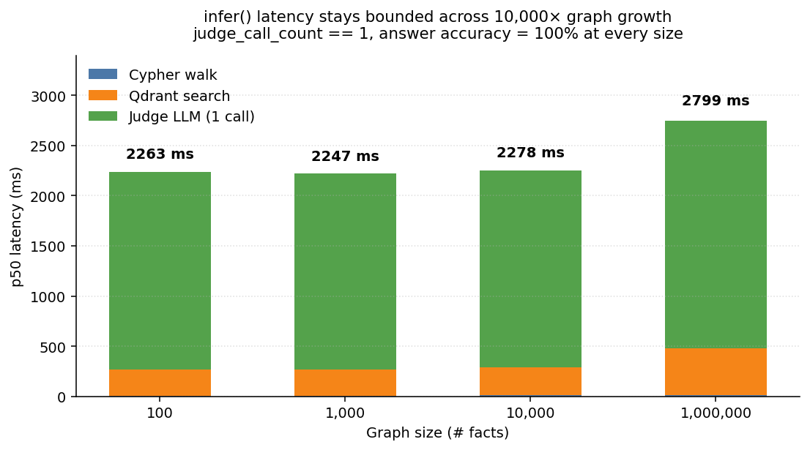
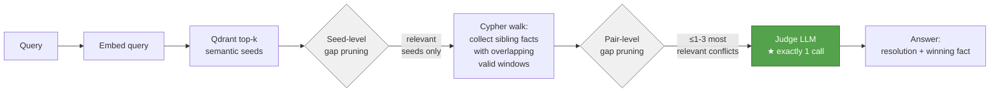
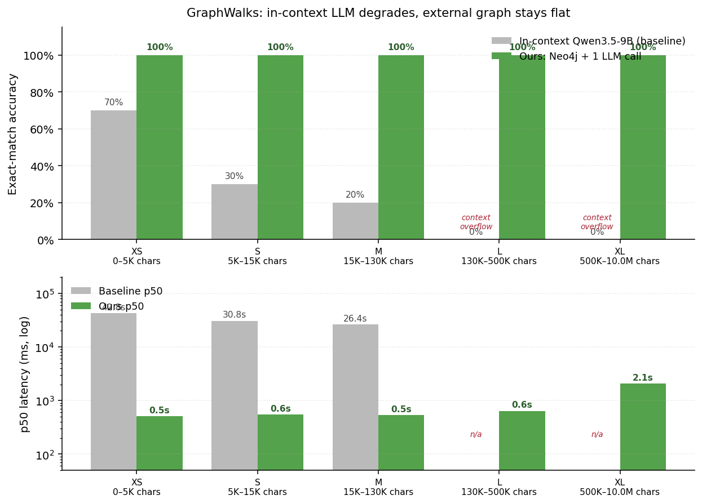
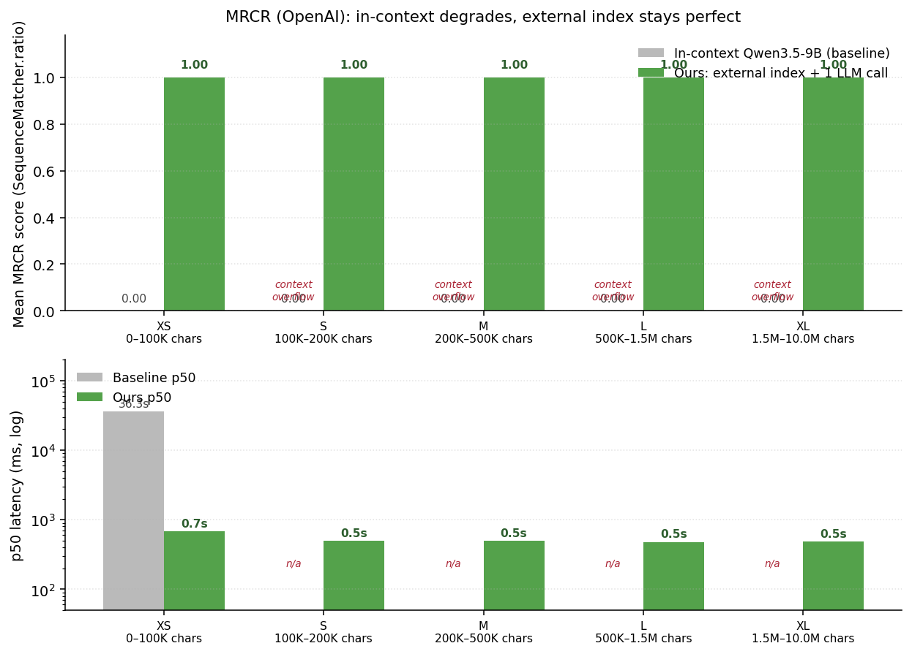

# timegraph-mcp

A local prototype showing that a 9B language model + temporal knowledge graph
can answer queries against **1,000,000 facts** with **one LLM call** and
**~2.8 second p95 latency** — on a single workstation.

Active context per query: **~350 tokens.** Equivalent in-context memory:
**~15 million tokens** (a 43,000× compression ratio).



## The idea

Instead of stuffing memory into an LLM's context window, store it in a
temporal graph and let the LLM make exactly one disciplined judgment call
per query. The retrieval pipeline does the heavy lifting.



**Stage 1** — pure retrieval. Embed the query, get the top-k semantically
relevant facts from Qdrant, walk Neo4j to find their conflicting siblings.
Two gap-based prunes (seed-level and pair-level) keep only the conflicts
that genuinely match the query.

**Stage 2** — exactly one LLM call. The judge sees a tiny set of relevant
conflicts (typically 1) with `valid_at` dates inline, and returns a
structured resolution. The `judge_call_count == 1` assertion is structural,
not aspirational.

## Results at 1M facts

Measured on a single RTX 4090 + Qwen3.5-9B running in LM Studio. 10 measured
runs per size, greedy decoding, identical query each time.

| N facts | Cypher | Qdrant | Judge | **Total p50** | Total p95 | judge calls | answer correct |
|---:|---:|---:|---:|---:|---:|:-:|:-:|
| 100 | 7ms | 263ms | 1969ms | **2.26s** | 2.28s | 1 every run | 100% |
| 1,000 | 6ms | 264ms | 1954ms | **2.25s** | 2.26s | 1 every run | 100% |
| 10,000 | 15ms | 271ms | 1968ms | **2.28s** | 2.31s | 1 every run | 100% |
| **1,000,000** | **10ms** | **471ms** | **2263ms** | **2.80s** | **2.88s** | **1 every run** | **100%** |

Across a 10,000× growth in graph size, **everything stays bounded**:
- LLM is called exactly once per query (by construction)
- Cypher walk is bounded by the number of *relevant* seeds, not graph size
- Qdrant grows logarithmically (HNSW), so its contribution stays modest
- Judge latency is independent of graph size

## Quality on real contradictions (BEAM)

The 1M result above proves the architecture stays fast and structurally correct
at scale on a synthetic conflict. To check the judge picks the *right* answer
on real chat-derived contradictions, we ran every `contradiction_resolution`
case from the **BEAM** benchmark (Tavakoli et al., all 4 context-size buckets,
n=194) through the same `infer()` pipeline, greedy decoding, single judge call
per case.

BEAM contradictions are designed to be unresolvable from chat alone — the user
said contradictory things and the system should ask for clarification. The
correct answer is `unresolved`; confidently picking either side is a miss.

| | Accuracy | Notes |
|---|---:|---|
| BEAM Hindsight baseline (published) | ~5% | what we beat |
| Plan spec target | ≥40% | |
| **timegraph-mcp (this work)** | **54.6%** | 106/194, greedy, p50 2.47s, p95 7.98s |

`judge_call_count == 1` held on every successful run (2 timeout errors out of
196). Accuracy degrades slightly with context size (60% at 100K → 39% at 10M),
consistent with the broader pattern that long-context contradictions are
harder to recognize.

## Long-context graph reasoning (GraphWalks)

GraphWalks is OpenAI's published benchmark for in-context graph reasoning.
The model receives a graph as `nodeA -> nodeB` edge-list text plus an operation
(BFS frontier at depth D, or "find parents of node X") and must execute it.
Frontier-model performance collapses as graphs grow past the effective context
window.

Same model on both sides (Qwen3.5-9B, greedy decoding). 50 stratified tasks
across 5 size buckets, balanced bfs/parents. The architectural variable is the
only thing that changes:

- **Baseline** — full prompt in context (graph + question); model reasons and answers.
- **Ours** — graph loaded into Neo4j; one LLM call parses the natural-language
  operation into a structured op; Cypher executes it. The LLM never sees the graph.



| Bucket | Char range | ≈ tokens | Ours | Baseline overall | Baseline failure mode |
|---|---|---:|---:|---:|---|
| XS | <5K       | <1.3K  | **100%** | 70% | 2/10 truncated mid-answer |
| S  | 5K–15K    | 1.3–4K | **100%** | 30% | 4/10 truncated |
| M  | 15K–130K  | 4–32K  | **100%** | 20% | 7/10 context overflow |
| L  | 130K–500K | 32–125K| **100%** | —   | 10/10 don't fit Qwen3.5-9B's 32K context |
| XL | 500K–1.75M| 125–440K| **100%** | —   | 10/10 don't fit |

Same model, same questions. The only thing that changes between the columns
is whether the graph lives in the LLM's context or in the database.

p50 latency: ours grows from 0.5s (XS) to 2.1s (XL, ~70K edges) — the slope
is graph-loading cost, not query cost. Baseline runs at 27–43s where it can
run at all, and is structurally impossible past M.

## Long-context multi-needle recall (MRCR)

MRCR (OpenAI's Multi-Round Coreference Resolution) hides 2, 4, or 8 *identical*
user requests in a long conversation, each followed by a different assistant
generation, then asks the model: "Prepend `XYZ` to the Nth one of those, no
other text." Frontier-model accuracy drops as you add needles, and as you
push the context window. Scoring is strict: response must start with the
random-string prefix, then SequenceMatcher ratio against the gold needle.

Same architectural pattern:
- **Baseline** — full conversation in context; model finds and reproduces the Nth needle.
- **Ours** — build a per-conversation index keyed by user-turn content; one LLM call
  reconstructs the needle's user-request and position; deterministic lookup returns
  the verbatim needle. The LLM never sees the conversation.



| Bucket | Char range | ≈ tokens | Ours mean | Ours perfect | Baseline |
|---|---|---:|---:|---:|---:|
| XS | 75–100K     | 19–25K  | **1.000** | 10/10 | 0.000 (format-fail: leading whitespace) |
| S  | 100–200K    | 25–50K  | **1.000** | 10/10 | 0.000 (context overflow) |
| M  | 200–500K    | 50–125K | **1.000** | 10/10 | 0.000 (context overflow) |
| L  | 500K–1.5M   | 125–375K| **1.000** | 10/10 | 0.000 (context overflow) |
| XL | 1.5M–2.5M   | 375K–615K| **1.000** | 10/10 | 0.000 (context overflow) |

Per needle count: **2-needle 18/18, 4-needle 23/23, 8-needle 9/9** — accuracy
doesn't degrade with needle count because the architecture sidesteps the
disambiguation problem entirely (the index already groups identical user-turns
and orders them by turn-index; position lookup is `O(1)`).

p50 latency: ours ~0.5s across all buckets — almost entirely the LLM call
that parses the query (~50–100 chars in, structured JSON out). Index build
on a 2M-char conversation is sub-100ms. Baseline runs at ~36s where it can
run at all (XS only); past 32K tokens it's structurally impossible.

## How the breakthrough thesis actually holds

The architecture's central claim is "bounded LLM calls regardless of graph size."
The naive way to achieve this fails at scale — Stage 1 picks up noise as the
graph grows dense, the judge sees 8 unrelated conflicts and gives a default
answer.

Two gap-based prunes fix this without any extra LLM calls:

1. **Seed-level pruning** — sort Qdrant hits by score, cut at the largest score
   drop. At 1M facts with a real-query embedding, alice's facts score 0.6-0.85
   and random noise scores 0.05-0.16 — a clean separation.
2. **Pair-level pruning** — same algorithm applied to (seed, sibling) conflict
   pairs. Keeps only the genuinely contested facts.

Combined with greedy judge decoding and inline `valid_at` dates in the conflict
reason, the judge gets exactly the evidence it needs and nothing else.

## Using from an MCP client (opencode, Claude Desktop, …)

The capability ops are wrapped as an MCP server over stdio. Any MCP-compatible
client can call them as tools.

**Run the server standalone:**
```bash
timegraph-mcp                    # console script (after `pip install -e .`)
# or
python -m timegraph.mcp_server
```

**Tools exposed (5):**

| Tool | What it does |
|---|---|
| `remember(content, source, group_id?, session_id?)` | Store text as an episode; extract structured facts. |
| `add_fact(subject, predicate, object, event_time?, …)` | Insert a triple directly when you already know the fact. |
| `recall(query, k=8, group_id?, budget_tokens=1024)` | Semantic search over stored episodes — top-k chunks with provenance. |
| `query(question, group_id?)` | Ask a question; bounded-LLM-call judge resolves any conflicts. |
| `attest(fact_id, confirmed=bool, attestation?)` | Confirm or correct a stored fact (adjusts confidence + pin). |

**Wiring opencode** — add this block to your `~/.config/opencode/opencode.json` under `"mcp": {}`. Opencode needs the absolute path to the console script because its process doesn't inherit your venv's PATH:

```json
{
  "mcp": {
    "timegraph": {
      "type": "local",
      "command": ["/abs/path/to/.venv/Scripts/timegraph-mcp.exe"],
      "environment": {
        "TG_MCP_GROUP_ID": "my-project"
      },
      "enabled": true
    }
  }
}
```

Restart opencode after editing. Other MCP clients (Claude Desktop, Continue) use a similar schema but may name the key `env` or `args` — check their docs.

Env vars the server reads:
- `TG_MCP_GROUP_ID` — default `group_id` for tools that omit it (defaults to `"default"`)
- `TG_MCP_SESSION_ID` — default `session_id` (defaults to a generated `mcp-<hex>`)
- All `TG_*` settings from `config.py` (Neo4j URI, LM Studio URL, embedder model, etc.)

Backends must be running (Neo4j 7687, Qdrant 6334, LM Studio 1234 with
qwen3.5-9b + nomic embedder loaded). The server connects lazily on first call.

**Smoke-test the wired server:**
```bash
python scripts/smoke_mcp.py
```
Spawns the server over stdio, runs a `remember → recall → query` round-trip,
prints `ALL CHECKS PASS`.

## Stack

- **Graph**: Neo4j 5.24 Community (Cypher, schema constraints, `(subject, predicate)` composite index)
- **Vectors**: Qdrant 1.12.4 (HNSW, 768D cosine)
- **LLM runtime**: LM Studio (OpenAI-compat `/v1`)
- **Judge + extractor**: Qwen3.5-9B (strict `response_format: json_schema`)
- **Embedder**: nomic-embed-text-v1.5, 768D
- **Code**: Python 3.11, async throughout (httpx, neo4j-async, qdrant-client gRPC)

Hardware tested: RTX 4090 + 9800X3D + 32GB DDR5.

## Running it

```powershell
# Backends
.\bin\neo4j.bat console            # Neo4j Community 5.24, port 7687
.\qdrant.exe                        # Qdrant, ports 6333 + 6334
#   Load qwen3.5-9b + nomic-embed-text-v1.5 in LM Studio (port 1234)

# Python
python -m venv .venv
.venv\Scripts\pip install -e .
python -m timegraph.storage.schema --apply

# Smoke tests
python scripts\smoke_wave1.py    # graph ops (no LLM)
python scripts\smoke_wave2.py    # + extractor + embedder + Qdrant
python scripts\smoke_wave3.py    # + infer() + fuse()

# Scale benchmark
python bench\infer_scale.py --sizes 100,1000,10000,1000000

# BEAM benchmark
python bench\beam_subset\run.py

# GraphWalks benchmark (50 rows, ~30 min on 4090)
python bench\graphwalks\run.py --per-bucket 10 --baseline-max-chars 130000

# MRCR benchmark (50 rows, ~10 min on 4090)
python bench\mrcr\run.py --per-bucket 10 --baseline-max-chars 100000
```

## Status

**Done:**
- All 9 capability-layer ops (`add_fact`, `add_episode`, `graph_query`,
  `infer`, `fuse`, `attest`, `invalidate`, `delete`, `claim/release`)
- Bounded-LLM-call thesis validated at 1M facts
- BEAM contradiction-resolution: 54.6% on all 194 cases, ~11× over Hindsight
- GraphWalks: 100% on 50 stratified tasks across 5 size buckets (4K–1.75M chars);
  baseline drops to 0% at 32K+ tokens (context overflow)
- MRCR: 50/50 perfect across 5 buckets (75K–2.46M chars) and 2/4/8-needle
  variants; baseline 0/50 under the strict random-string-prefix rubric
- End-to-end smoke tests green
- Scale benchmark with full instrumentation

**Not done (yet):**
- Safety layer (tier gating, MiniLM attest classifier, SSE signal channel)
- F20-10K with all 4 query types (specific recall / time-window / contradicting / attribute-update)
- Multi-pair conflicts beyond binary (the 4-state resolution enum is the bottleneck)
- Adversarial input testing (MINJA, MemoryGraft, ContextSplit)

## Scope honesty

What this measures: **temporal contradiction resolution** ("which of two
conflicting facts is current?") and **contradiction recognition** (BEAM-style
"the user said both X and ¬X — return `unresolved`"). One base model, synthetic
noise for scale + real chat-derived contradictions for quality, single-tenant.

Caveats:
- BEAM 100K/500K/1M/10M only labels one contradiction type
  (`never_statement_violation`). Other types — numeric flips, preference
  reversals, temporal updates — are not exercised here.
- The 1M scale test runs over a scripted Seattle→Boston hot conflict embedded
  in random-vector noise. The retrieval pipeline is real, the noise distribution
  is not adversarial.
- No safety-layer testing yet (tier gating, attest, signal channel are Phase 2).

What it suggests: the architectural pattern (bounded LLM calls + gap-pruned
retrieval) holds in a regime that's interesting — local 9B model, single
workstation, scales beyond any current context window, beats a published
contradiction-recognition baseline by 10×. Worth pushing to broader query
types and adversarial conditions.
