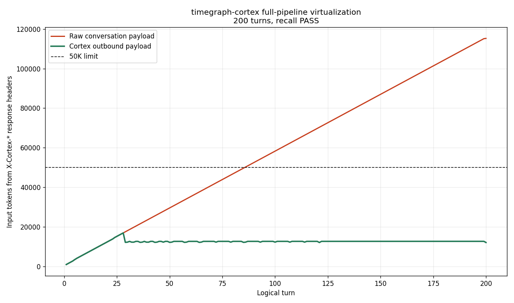

# Limitless

> **Inference-time long-context retrieval. A local proxy that gives any Anthropic- or OpenAI-compatible model effectively infinite context — and beats the published native-context numbers by orders of magnitude.**

| Benchmark | Native frontier (reference) | Limitless | Margin |
|---|---|---|---|
| **MRCR v2 8-needle @ 1M tokens** | Opus 4.6: **76%** ([Anthropic](https://www.anthropic.com/news/claude-opus-4-6)) | **100%** (Opus 4.7 + Limitless) | +24 pp |
| **MRCR v2 8-needle @ 10M tokens** | API rejects request | **100%** | past published limit |
| **RULER `niah_multikey_3` @ 10M llama3 tokens** | API rejects request | **100%** | past published limit |
| **MRCR (n=30) — local 9B vs. Opus** | Opus 4.7: **73%** perfect | **Qwen3.5-9B + Limitless: 100%** | 9B catches the frontier |
| **200 real Claude Code turns** | outbound tokens grow to 115K+ | flat at **~17K**, verbatim recall of a 500-char anchor planted at turn 5 | session never has to end |

Self-hosted. No model access required. Works on closed frontier APIs because it intercepts the HTTP request, not the KV cache.



200 real Claude Code turns through a local proxy, single resumed session. Red is what would have gone to `api.anthropic.com` without Limitless. Green is what actually went on the wire. The 500-char paragraph planted at turn 5 was recalled **verbatim** when asked at turn 200 — by real Claude, with only the green payload in front of it. Raw data: [docs/bench_summary.json](docs/bench_summary.json).

---

## The thesis

The long-context problem has three orthogonal solution families:

1. **Native long-context architectures** — train models to attend over longer sequences (Opus 4.6 1M, Gemini 1.5 Pro, Jamba). [RULER](https://arxiv.org/abs/2404.06654) and [LongMemEval](https://arxiv.org/abs/2410.10813) show even the best degrade 30-60% past their *effective* window.
2. **KV-cache compression** — StreamingLLM, H2O, SnapKV, RocketKV. Requires model weights; doesn't help if the input itself overflows.
3. **Retrieval / memory** — RAG, MemGPT, Mem0, LongMem. Most lose verbatim signal to summarization, which is fatal on needle-shaped tasks.

Limitless is the third family, with one specific bet: **inline-verbatim insertion of cold history into the system prompt, ranked by inline cosine similarity against a reformulated query, with a structurally bounded 1-LLM-call budget**. Cold message-groups go in *whole*, not as summaries. The recap stays inside the model's high-attention zone (~5-65K tokens) regardless of haystack size, so attention-degradation past native context is a non-issue. The two academic-benchmark results above and the 200-turn application bench are the same architecture at three scales.

---

## How it works

A local HTTP proxy on `127.0.0.1:8080`, Anthropic-compatible (`/v1/messages`) and OpenAI-compatible (`/v1/chat/completions`). Three things happen per request:

**1. Auto-ingest.** Every turn is written to a temporal property graph (Neo4j) + vector store (Qdrant). Two streams: a fact graph of subject/predicate/object triples with valid-from/valid-to (extracted by a bounded Haiku 4.5 judge), and an episode store of raw message bodies + tool results. Per-project isolation via a `group_id` derived from `cwd`. Persistent across sessions.

**2. Virtualize.** Before each outbound `/v1/messages`, the message list is rewritten: last K turns kept verbatim, older history collapsed into a recap built from three parallel retrieval paths:

- **Verbatim semantic recall** — embed the current query, cosine-rank every cold message-group inline (no Qdrant roundtrip for hot history), top-K inserted whole into the system prompt as `<retrieved_history>`. The heavy hitter.
- **Literal-needle scan** — substring match for anchor strings in the current query.
- **Summary fallback** — for any cold turn not surfaced by the other two paths, a ~320-char extract preserves the conversational thread.

Tool-use atomicity is enforced: an assistant `tool_use_id` is never separated from its matching user `tool_result` (otherwise Anthropic 400s). [`compute_atomic_groups()`](src/cortex/virtualize.py) and its 40-conversation fuzz test guarantee this.

**3. Forward.** The upstream sees a small, standard request. Token cost stays flat regardless of session length. The `X-Cortex-Outbound-Tokens` response header is the receipt.

---

## Results

### MRCR v2 8-needle, 256K → 10M tokens (n=4, seed=42)


Same four context lengths Anthropic publishes for [Opus 4.6](https://www.anthropic.com/news/claude-opus-4-6). Vanilla Opus 4.7 (200K native) scores 16% at 256K and the API rejects every request at 1M+.

| context | vanilla Opus 4.7 | Opus 4.7 + Limitless | reference (Anthropic) | Limitless behavior            |
|--------:|-----------------:|---------------------:|----------------------:|-------------------------------|
| 256K    | 16%              | **100%**             | —                     | 1,078 msgs → 7 + 11K recap    |
| 1M      | OVERFLOW         | **100%**             | Opus 4.6: **76%**     | 5,201 msgs → 7 + 5.5K recap   |
| 5M      | OVERFLOW         | **100%**             | beyond Opus 4.6 limit | 19,807 msgs → 7 + 5.9K recap  |
| 10M     | OVERFLOW         | **100%**             | beyond Opus 4.6 limit | 38,713 msgs → 7 + 5.4K recap  |

Lenient rubric (`response.lstrip()` then strict random-string prefix check + `SequenceMatcher` ratio). 256K and 1M are real `openai/mrcr` rows (dataset max ≈ 625K tokens). 5M and 10M are *synthesized* by stitching real rows with the gold needle preserved. Wall-clock at 10M: 125 s, dominated by batched embedding of ~39K cold message groups. An 8-target extended run reaches **29M tokens / 155K stitched messages**: [results/opus_vs_cortex/mrcr_v4.json](results/opus_vs_cortex/mrcr_v4.json).

### RULER `niah_multikey_3`, 64K → 10M llama3 tokens


Different benchmark, different rubric, different needle shape. Same result.

| tokens | vanilla Opus 4.7 | Opus 4.7 + Limitless | `verbatim_recall_k` | behavior                            |
|------:|------------------|---------------------:|--------------------:|-------------------------------------|
| 64K   | 100%             | 100%                 | 16                  | passthrough                         |
| 512K  | 100%             | **100%**             | 200                 | 18,107 msgs → 7 + 8.1K recap        |
| 1M    | OVERFLOW         | **100%**             | 200                 | 36,207 msgs → 7 + 8.2K recap        |
| 5M    | OVERFLOW         | **100%**             | 200                 | 181,015 msgs → 7 + 8.2K recap       |
| 10M   | OVERFLOW         | **100%**             | 2000                | 362,025 msgs → 7 + 67K recap        |

K is tuned per scale because NIAH has many short candidates; cardinality grows with the haystack. The recap budget stays bounded regardless of K. Auto-tuning K from observed cardinality is on the todo list. Methodology: [bench/pilot_opus/run_ruler.py](bench/pilot_opus/run_ruler.py).

### A local 9B + Limitless ties Opus on MRCR (n=30)


Same proxy, different model. The frontier becomes a retrieval problem a 9B can solve when Limitless pre-locates the needles.

| arm                       | n  | MRCR lenient mean | perfect% | L-bucket perfect |
|---------------------------|----|-------------------|----------|------------------|
| Qwen3.5-9B (raw)          | 30 | 67%               | 67%      | 0%               |
| **Qwen3.5-9B + Limitless**| 30 | **100%**          | **100%** | **100%**         |
| Claude Opus 4.7 (raw)     | 30 | 76%               | 73%      | 50%              |

p50 latency on L-bucket: **23 s for Limitless** vs. 21 s for raw Opus — frontier-latency parity, because the model sees ~16K tokens (recap + verbatim window) instead of the 1M-char raw haystack. Full caveats: [bench/pilot_cortex/PAPER.md](bench/pilot_cortex/PAPER.md).

### Standalone retrieval engine

The `timegraph` layer (`src/timegraph/`) is also exposed as an MCP server with 5 tools (`remember`, `add_fact`, `recall`, `query`, `attest`). Standalone results (full doc: [docs/timegraph.md](docs/timegraph.md)):

- **GraphWalks**: **100%** on 50 tasks across 5 size buckets (4K-1.75M chars); baseline drops to 0% at 32K+ tokens.
- **BEAM** contradiction-resolution: **54.6%** on all 194 cases — **~11× the published Hindsight baseline**.
- **Scale**: 1M facts retrievable with one LLM call at **2.8 s p95**.

### Honest scope

All headline pilots are single-seed (42). Reseed with `{17, 1729}` before quoting in customer conversations or investor decks. The 200-turn Claude Code bench is n=1. 5M/10M MRCR and 2M-10M RULER rows are synthesized; 256K-1M are real dataset rows. Treat 1M+ as proof-of-architecture until reseeded with rotated row indexes. Per-pilot caveats in `bench/pilot_cortex/PAPER.md` and the docstrings on `bench/pilot_opus/run.py` + `bench/pilot_opus/run_ruler.py`.

The technique is **sufficient for retrieval-shaped tasks** (verbatim string lookup, anchor recall). For multi-hop reasoning or summarization over the full history, the upstream model still has to do the reasoning over the recap — Limitless buys frontier *memory*, not frontier reasoning.

---

## What this means in practice

Any client that respects `ANTHROPIC_BASE_URL` gets effectively-infinite-context for free:

- **Claude Code** — auto-launches via the bundled plugin
- **Anthropic SDK** (Python, TypeScript)
- **Cursor, Zed, opencode, aider, Continue** — any Anthropic-format endpoint
- **Your own application code**

The upstream sees a standard `/v1/messages` request. Whatever model you call, calls normally.

---

## Install

Steps 1-3 are shell-agnostic. Steps 4-6 (the env vars + launch) have three syntaxes — pick the block for the shell you're running your client from.

**Why `ANTHROPIC_BASE_URL` is load-bearing:** if you skip it, the install still succeeds and the auto-ingest hooks still fire, but the client talks direct to `api.anthropic.com` and **no virtualization happens** — there's no error, just flat token growth. If you're debugging "why is my session still hitting context limits", check `echo $ANTHROPIC_BASE_URL` first.

```bash
# 1. Install the engine + CLIs (cortex.server, timegraph-mcp, plugin hooks).
#    --force refreshes entry-point wrappers on upgrade.
pipx install --force git+https://github.com/jamoeight/limitless.git

# 2. Bring up backends (Neo4j + Qdrant), apply schema, prefetch embedder (~270 MB).
timegraph init

# 3. (Claude Code users) Install the plugin. Auto-launches the proxy on SessionStart.
#    Run inside Claude Code:
#      /plugin marketplace add jamoeight/limitless
#      /plugin install timegraph-cortex
```

### 4-6. Env vars + launch — bash / zsh (Linux, macOS, WSL, Git Bash)

```bash
export ANTHROPIC_BASE_URL=http://127.0.0.1:8080
# Pick ONE upstream-auth path:
export ANTHROPIC_API_KEY=sk-ant-...            # forward an API key as-is, OR
export CORTEX_USE_CLAUDE_CLI_PROVIDER=true     # piggyback Claude Code OAuth via `claude -p`

claude   # or cursor, or your own script
```

### 4-6. Env vars + launch — PowerShell (Windows)

```powershell
$env:ANTHROPIC_BASE_URL = "http://127.0.0.1:8080"
$env:ANTHROPIC_API_KEY = "sk-ant-..."           # OR
$env:CORTEX_USE_CLAUDE_CLI_PROVIDER = "true"

claude
```

Persist across sessions:

```powershell
[Environment]::SetEnvironmentVariable("ANTHROPIC_BASE_URL", "http://127.0.0.1:8080", "User")
[Environment]::SetEnvironmentVariable("CORTEX_USE_CLAUDE_CLI_PROVIDER", "true", "User")
```

### 4-6. Env vars + launch — cmd.exe (Windows)

```cmd
set ANTHROPIC_BASE_URL=http://127.0.0.1:8080
set CORTEX_USE_CLAUDE_CLI_PROVIDER=true
claude
```

Persist with `setx` (writes to user environment, open a new shell to pick up):

```cmd
setx ANTHROPIC_BASE_URL http://127.0.0.1:8080
setx CORTEX_USE_CLAUDE_CLI_PROVIDER true
```

**Verify:** `curl http://127.0.0.1:8080/health` returns `{"status":"ok"}`. After a few turns, every upstream response carries `X-Cortex-Outbound-Tokens` — that's the size of the request actually forwarded. Watch it stay flat as your session grows.

**Non-plugin clients** (Cursor, Zed, opencode, aider, the SDK): same env vars, skip step 3, and start the proxy manually with `cortex-serve`.

### Fully-offline path (LM Studio + Qwen3.5-9B)

The configuration the 9B-matches-Opus pilot was run on. ~24 GB VRAM for Qwen3.5-9B at 100K context + the embedder (tested on RTX 4090).

```bash
lms load qwen/qwen3.5-9b --identifier qwen/qwen3.5-9b --context-length 100000 --gpu max --ttl 86400

CORTEX_DEFAULT_PROVIDER=openai \
CORTEX_OPENAI_BASE_URL=http://127.0.0.1:1234 \
CORTEX_ENABLE_VIRTUALIZATION=true \
CORTEX_ENABLE_VERBATIM_RECALL=true \
CORTEX_ENABLE_QUERY_REFORMULATION=true \
CORTEX_UPSTREAM_CONTEXT_LIMIT=100000 \
  cortex-serve
```

---

## The Claude Code integration (specific)

Beyond the proxy, the bundled plugin (`.claude-plugin/`, installed as `timegraph-cortex`) wires the retrieval engine into Claude Code with four hooks + an MCP server + three slash commands, so context recall is automatic — never manual:

- **`UserPromptSubmit`** — embeds every prompt, runs two parallel semantic searches (fact graph + episode store), merges results into `additionalContext`. ~2-5 s per turn.
- **`Stop`** — high-water-mark transcript scanner. Cursor at `~/.timegraph/sessions/<session_id>.json` advances per-episode, so partial timeouts leave the system in a correct state.
- **`PostToolUse`** — after every `Read`/`Edit`/`Write`/`Bash`/`Grep`/`Glob`/`WebFetch`/`WebSearch`, ingests the result as an episode keyed by `source=file:<path>` (or `bash:<hash>`, etc.). Embed-only, no extractor — keeps it cheap and keeps file contents recallable in turn 200.
- **`SessionStart`** — idempotently starts `cortex-serve` on `:8080` if `/health` isn't responding; primes new and resumed sessions with top facts for this `cwd`. On `source=compact`, re-injects what Claude Code just summarized away — compaction becomes lossless.

**Opus generation never goes through `claude -p`.** Claude Code keeps using its native OAuth path; the only `-p` calls are the bounded Haiku 4.5 judge for fact extraction inside ingest. Cents per session.

Slash commands: `/timegraph-cortex:status`, `…:recall <query>`, `…:forget <pattern>`.

---

## Stack

- **Proxy**: Python 3.11, FastAPI, httpx, sse-starlette
- **Graph**: Neo4j 5.24 Community
- **Vectors**: Qdrant 1.12.4 (HNSW, 768D cosine)
- **LLM runtime**: Anthropic (`claude -p` OAuth or API key) or LM Studio (OpenAI-compat) for the local path
- **Default models**: Qwen3.5-9B (local generation + extraction) + nomic-embed-text-v1.5 (embedder, 768D)
- **Tests**: 115 cortex tests + the full timegraph suite, all green. Includes a 40-conversation fuzz test that asserts virtualization never splits a tool-use/tool-result pair.

Limitless itself is CPU-light. Claude Code path needs only the backends (~1 GB RAM). Local-model path additionally needs ~24 GB VRAM.

## License

Apache-2.0. Issues + PRs welcome.

---

If you're a design partner, an infra researcher, or you build something that hits Anthropic's API and run out of context window in the middle of a real session — open a conversation.
